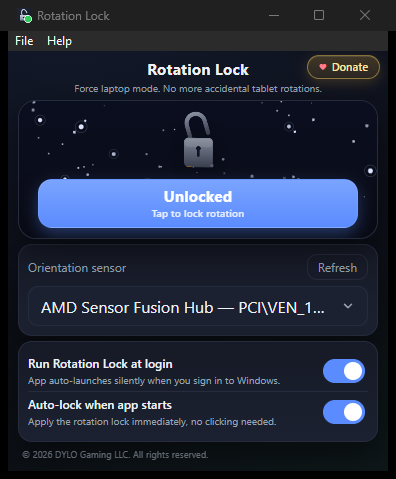
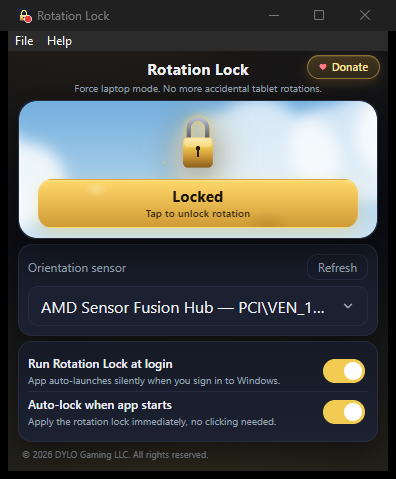

# Rotation Lock

<p align="center">
  
  
</p>

A Windows utility that locks orientation on convertible laptops. No more screen flipping when you tilt the device. Persists across sleep, wake, and reboot.

## Taskbar & Tray icon

<table>
<tr>
<td align="center"></td>
<td align="center"></td>
</tr>
<tr>
<td align="center"><b>Unlocked</b></td>
<td align="center"><b>Locked</b></td>
</tr>
</table>

The same icon shows in the system tray and on the taskbar. Left-click to toggle, right-click for menu.

## Install

Download `Rotation Lock.exe` from [Releases](https://github.com/dylogaming/Rotation-Lock/releases). Run it. UAC prompts for elevation (needed to access the sensor driver). Single self-contained `.exe`, no installer.

## Build from source

```sh
git clone https://github.com/dylogaming/Rotation-Lock.git
cd Rotation-Lock
cargo build --release --manifest-path src-tauri/Cargo.toml
```

## License

Proprietary: see [LICENSE](LICENSE). Free for personal use.

## Contact

dylogamingofficial@gmail.com :: [Ko-fi](https://ko-fi.com/dylogaming) ☕
